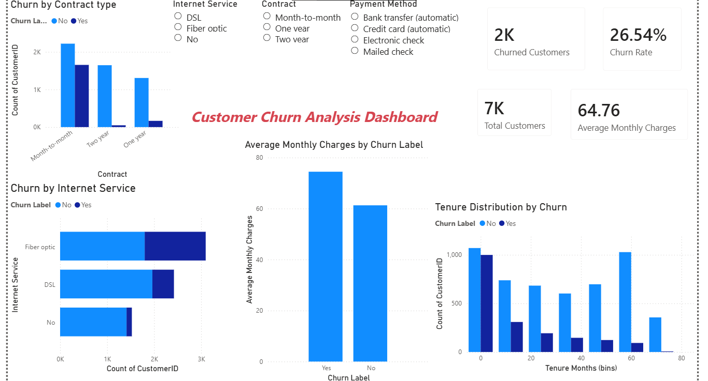

Project Objective

The objective of this project is to analyze customer data to understand the factors contributing to customer churn. Identifying patterns behind customer churn helps businesses improve retention strategies and reduce customer loss.

Dataset

The dataset contains 7,043 telecom customer records with information about demographics, services used, contract types, and billing details.

Key features include:

- Customer demographics (Gender, Senior Citizen, Dependents)
- Contract type
- Internet service type
- Monthly charges and total charges
- Tenure (customer lifetime)
- Payment method
- Churn status

Tools & Technologies

- Python
- Pandas
- Matplotlib
- Seaborn
- Jupyter Notebook

Analysis Performed

- The project analyzes multiple factors affecting churn, including:
- Customer churn distribution
- Contract type vs churn
- Tenure vs churn
- Monthly charges vs churn
- Internet service type vs churn

These analyses help identify patterns that influence customer retention.

Key Business Insights

- Customers with month-to-month contracts exhibit the highest churn rate.
- Customers with shorter tenure are more likely to churn.
- Customers with higher monthly charges tend to churn more frequently.
- Long-term contracts significantly improve customer retention.
- Retention strategies should focus on new customers and high-paying customers.

Power BI Dashboard 

An interactive dashboard was created using Power BI to visualize:
- Total Customers
- Churned Customers
- Churn Rate
- Average Monthly Charges
- Churn by Contract Type
- Churn by Internet Service
- Tenure Distribution by Churn

Conclusion

This project highlights how customer behavior and service factors influence churn. By identifying high-risk customer segments, businesses can implement targeted retention strategies to improve customer loyalty and reduce churn rates.
